# WPF Material

An implementation of [Google's Material Design 3](https://m3.material.io/) for WPF and .NET >= 6.

> **Note:** This project is in its early stages. I will provide more information and documentation as it progresses.


## 🖼️ Here's a demo of how the project is going so far

### Common Button

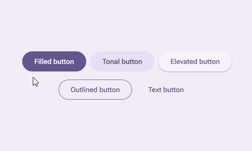

```xaml
<md3:Button Content="{content}" Type="{Filled | Tonal | Elevated | Outlined | Text}" />
```

#### Common button with icons

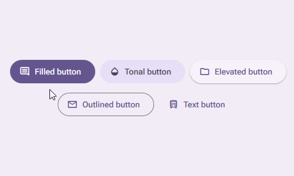

```xaml
<md3:Button 
    md3:Icon.RestSymbol="{icon}"
    Content="{content}" 
    Type="{Filled | Tonal | Elevated | Outlined | Text}" />
```

#### Common button with advanced icon settings

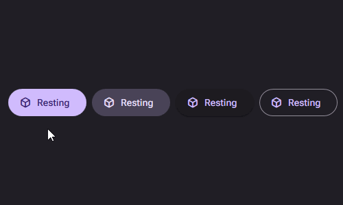

```xaml
<md3:Button 
    md3:Icon.RestSymbol="{icon}"
    md3:Icon.HoverSymbol="{icon}"
    md3:Icon.PressSymbol="{icon}"
    Content="{content}" 
    Type="{Filled | Tonal | Elevated | Outlined | Text}" />
```

### Floating Action Button (FAB)

FAB's with different sizes (small, standard and large) and types (surface, primary, secondary and tertiary).

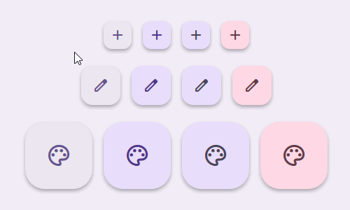

```xaml
<md3:FloatingActionButton 
    Size="{Small | Standard | Large}" 
    Type="{Surface | Primary | Secondary | Tertiary}" />
```

#### Extended FAB

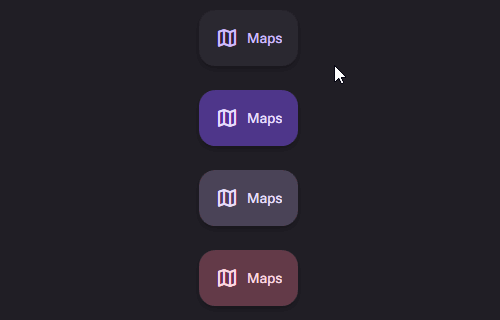

```xaml
<md3:FloatingActionButton 
    Content="{content}"
    CanExtend="True"
    IsExtended="{True | False}"
    Type="{Surface | Primary | Secondary | Tertiary}" />
```

### Segmented Buttons

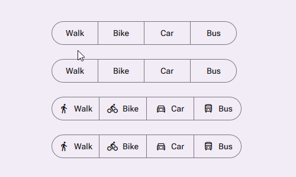

```xaml
<md3:SegmentedButtonGroup>
    <md3:SegmentedButton
        md3:Icon.RestSymbol="{icon}"
        md3:Icon.SelectionSymbol="{icon | null (remove checkmark)}"
        Content="{content}" />
        
    ...
</md3:SegmentedButtonGroup>
```

Segmented buttons with multiple selection

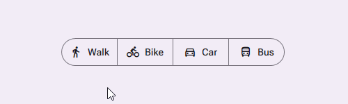

```xaml
<md3:SegmentedButtonGroup IsMultiSelect="{True | False}">
    <md3:SegmentedButton
        md3:Icon.RestSymbol="{icon}"
        md3:Icon.SelectionSymbol="{icon | null (remove checkmark)}"
        Content="{content}" />
        
    ...
</md3:SegmentedButtonGroup>
```

Segmented buttons with selection required

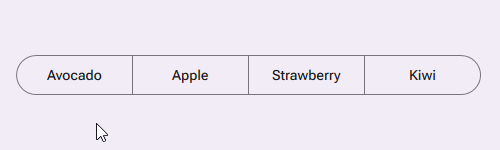

```xaml
<md3:SegmentedButtonGroup IsMultiSelect="{True | False}">
    <md3:SegmentedButton
        md3:Icon.RestSymbol="{icon}"
        md3:Icon.SelectionSymbol="{icon | null (remove checkmark)}"
        Content="{content}" />
        
    ...
</md3:SegmentedButtonGroup>
```

### Check Box

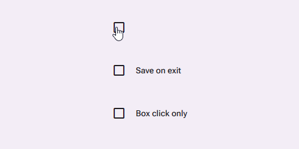

```xaml
<md3:CheckBox Content="{content}" IsContentClickable="{True | False}"/>
```

### Radio Button

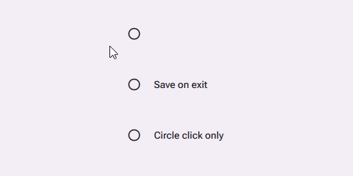

```xaml
<md3:RadioButton Content="{content}" IsContentClickable="{True | False}"/>
```

### Card

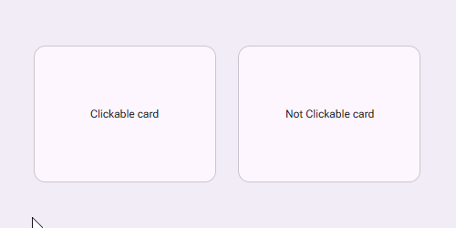

```xaml
<md3:Card Content="{content}" IsClickable="{True | False}"/>
```

#### Card types

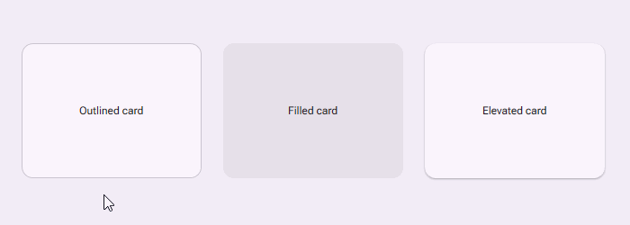

```xaml
<md3:Card Content="{content}" Type="{Outlined | Filled | Elevated}"/>
```

## 📜 License

This project is licensed under the [MIT License](LICENSE).
